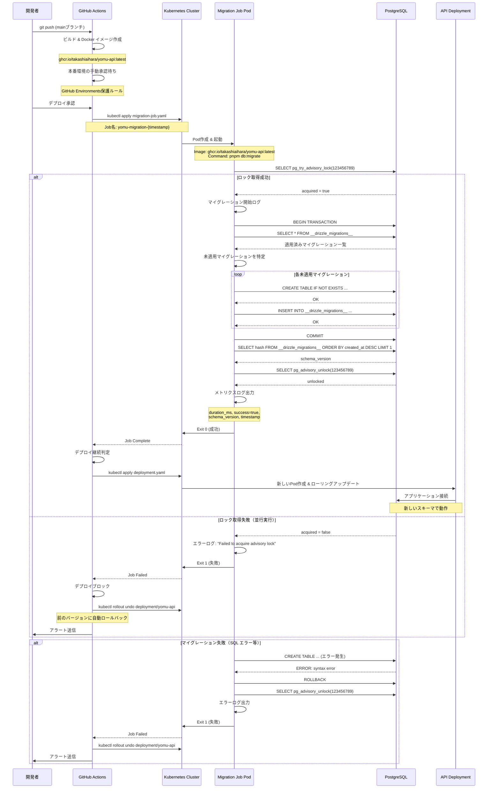
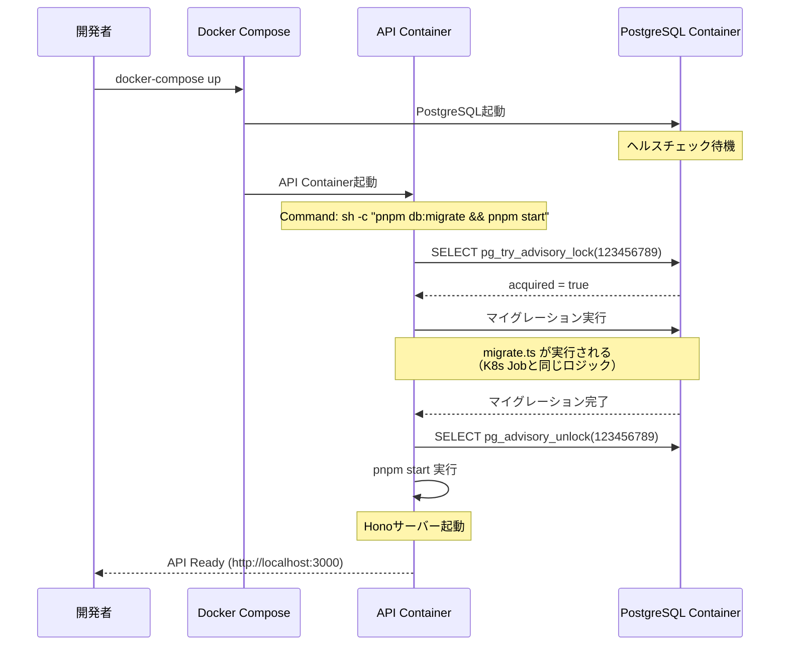
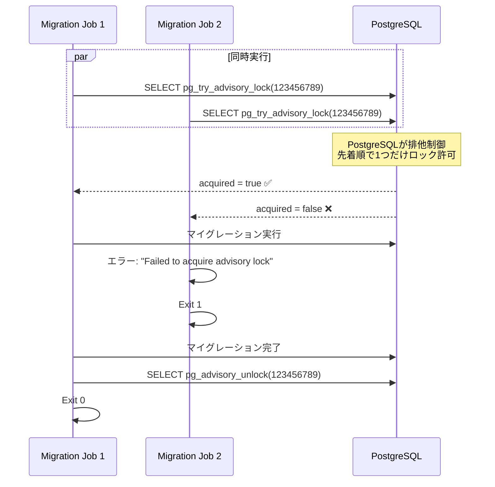
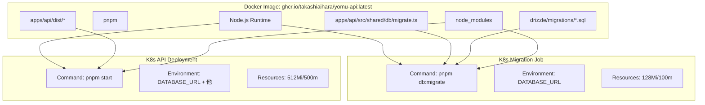

# マイグレーション実行フロー - シーケンス図

## K8s環境でのマイグレーション実行（本番想定）



## ローカル開発環境（Docker Compose）



## 並行実行の防止メカニズム



## コンテナイメージの構成



## 重要なポイント

### 1. 同じDockerイメージを使用

- **Migration Job**: `pnpm db:migrate` を実行
- **API Deployment**: `pnpm start` を実行
- **利点**: イメージの一貫性、マイグレーションとアプリの互換性保証

### 2. K8s Jobパターン

```yaml
# migration-job.yaml
apiVersion: batch/v1
kind: Job
spec:
  template:
    spec:
      containers:
      - name: migration
        image: ghcr.io/takashiaihara/yomu-api:latest
        command: ["pnpm", "db:migrate"]  # ← ここが違う
        envFrom:
        - configMapRef:
            name: yomu-config
        - secretRef:
            name: yomu-secrets
      restartPolicy: OnFailure
```

### 3. GitHub Actionsでの実行順序

```
1. Docker イメージビルド
   ↓
2. イメージをレジストリにプッシュ
   ↓
3. 手動承認待ち（本番のみ）
   ↓
4. Migration Job作成 & 実行
   ↓
5. Job完了待ち（300秒タイムアウト）
   ↓
6. 成功 → Deployment更新
   失敗 → ロールバック
```

この設計により、K8s環境では専用のJobコンテナでマイグレーションを実行し、成功した場合のみアプリケーションをデプロイします。
